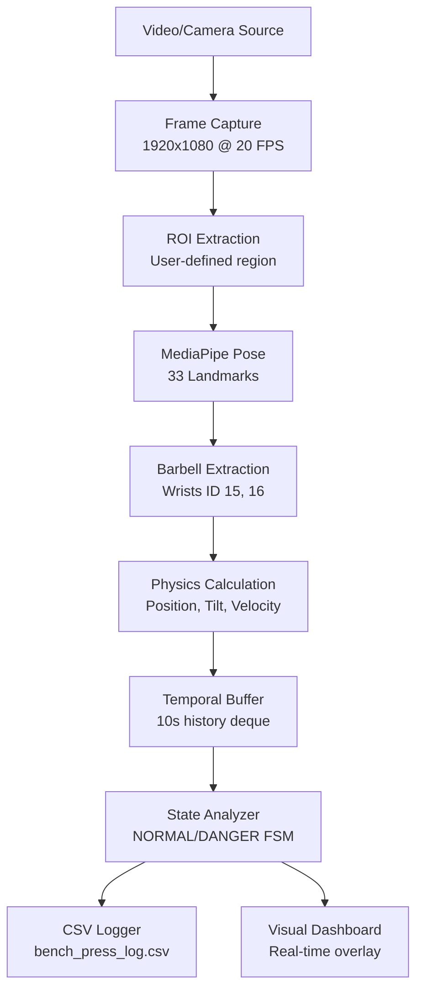

# 📊 Tổng Hợp Công Nghệ Dataset - Bench Press Guard

## Tổng Quan

Project **Bench Press Guard** sử dụng các công nghệ xử lý dữ liệu real-time để phát hiện nguy hiểm trong bài tập Bench Press. Document này tổng hợp tất cả các công nghệ dataset được sử dụng.

---

## 1. Nguồn Dữ Liệu (Data Sources)

Project hoạt động với **2 loại input data** chính:

### 1.1. Webcam Stream (Real-time)
- **Công nghệ**: OpenCV `VideoCapture`
- **Resolution**: 1920x1080 (2MP)
- **Hardware FPS**: 30 FPS
- **Processing FPS**: 20 FPS (throttled)
- **Implementation**: Multi-threaded streaming qua `CameraStream` class

**Đặc điểm:**
```python
# Camera initialization
camera = CameraStream(src=0, width=1920, height=1080)
```

- Sử dụng threading để tránh blocking
- Real-time frame buffering
- Automatic latency monitoring

### 1.2. Video Files (Demo Mode)
- **Format hỗ trợ**: .mp4, .avi, và các format video phổ biến
- **Auto FPS Detection**: Tự động detect và match video FPS
- **Throttling**: Simulate real-time playback

**Đặc điểm:**
```python
# Video file mode
python main.py --video "demo_video.mp4"
```

- Frame-by-frame processing với delay matching
- Không loop (stop khi hết video)
- Sử dụng cùng pipeline như webcam

---

## 2. Feature Extraction (Trích Xuất Đặc Trưng)

### 2.1. MediaPipe Pose Estimation

**Công nghệ core**: [Google MediaPipe Pose](https://google.github.io/mediapipe/solutions/pose.html)

**Model Configuration:**
```python
mp.solutions.pose.Pose(
    static_image_mode=False,
    model_complexity=1,              # Balanced speed/accuracy
    smooth_landmarks=True,            # Temporal smoothing
    min_detection_confidence=0.7,    # Detection threshold
    min_tracking_confidence=0.7      # Tracking threshold
)
```

**Output**: 33 body landmarks per frame

### 2.2. Landmark Data Structure

Mỗi frame được convert thành **33 keypoints** với format:

```python
{
    "id": 0-32,              # Landmark index
    "x_px": int,             # Pixel X coordinate
    "y_px": int,             # Pixel Y coordinate
    "x": 0.0-1.0,           # Normalized X (0-1)
    "y": 0.0-1.0,           # Normalized Y (0-1)
    "visibility": 0.0-1.0   # Confidence score
}
```

**Key Landmarks sử dụng:**
- **ID 11**: Left Shoulder (vai trái)
- **ID 12**: Right Shoulder (vai phải)
- **ID 15**: Left Wrist (cổ tay trái)
- **ID 16**: Right Wrist (cổ tay phải)

---

## 3. Temporal Data Storage (Lưu Trữ Dữ Liệu Thời Gian)

### 3.1. Time-Series Buffer

**Cấu trúc**: `collections.deque` (double-ended queue)

**Configuration:**
```python
BUFFER_SIZE_SEC = 10  # Lưu 10 giây data history
TARGET_FPS = 20       # 20 frames/second
# => Buffer capacity: 200 frames
```

**Dữ liệu lưu trữ:**
- Barbell position history (x, y coordinates)
- Velocity time-series
- Tilt angle history
- Stability metrics over time

**Mục đích:**
- Phát hiện stall (barbell không di chuyển)
- Tính velocity/acceleration
- Temporal smoothing
- State transition logic

### 3.2. Event Logging (CSV Dataset)

**File output**: `bench_press_log.csv`

**Schema:**
```csv
Timestamp,BenchID,State,Reason,Latency_ms
2026-01-21T07:30:15.123456,1,DANGER,Stalled Barbell,45
2026-01-21T07:30:20.654321,1,NORMAL,Resumed Movement,42
```

**Columns:**
- `Timestamp`: ISO 8601 format (datetime.now().isoformat())
- `BenchID`: Bench station identifier (hỗ trợ multi-bench)
- `State`: NORMAL | DANGER
- `Reason`: Chi tiết (Stalled Barbell, Tilt Detected, Uncontrolled Drop, etc.)
- `Latency_ms`: System processing latency

**Ứng dụng dataset:**
- Performance analysis
- Model evaluation metrics
- System monitoring
- Research dataset cho ML models

---

## 4. Region of Interest (ROI) Management

### 4.1. Interactive ROI Selection

**Công nghệ**: OpenCV `cv2.selectROI()`

**Workflow:**
1. Hiển thị first frame
2. User vẽ bounding box quanh bench area
3. Convert sang normalized coordinates (0-1)
4. Lưu trữ trong config

**Data Structure:**
```python
selected_roi = {
    "x": 0.0-1.0,  # Normalized X position
    "y": 0.0-1.0,  # Normalized Y position
    "w": 0.0-1.0,  # Normalized width
    "h": 0.0-1.0   # Normalized height
}
```

**Lợi ích:**
- Scale-independent (hoạt động với mọi resolution)
- Tối ưu performance (chỉ process ROI)
- Multi-bench support

### 4.2. Multi-Bench Architecture

**Data Structure:**
```python
benches = [
    {
        "id": 1,
        "roi": {"x": 0.2, "y": 0.1, "w": 0.6, "h": 0.8},
        "analyzer": BenchPressAnalyzer(fps=20)
    },
    # Có thể thêm nhiều benches...
]
```

**Scalability**: Architecture sẵn sàng cho multi-camera, multi-bench deployment

---

## 5. Derived Features (Đặc Trưng Tính Toán)

Từ raw landmarks, system tính toán các physics features:

### 5.1. Barbell Physics

**Input**: Wrist landmarks (ID 15, 16)

**Output Features:**

#### a) Position
```python
midpoint_x = (left_wrist.x + right_wrist.x) / 2
midpoint_y = (left_wrist.y + right_wrist.y) / 2
```

#### b) Tilt Angle
```python
dx = right_wrist.x - left_wrist.x
dy = right_wrist.y - left_wrist.y
tilt_angle = atan2(dy, dx) * 180 / π
```

#### c) Velocity
```python
# Computed from position buffer
velocity_y = (current_y - previous_y) / delta_time
```

#### d) Stability (Shake Detection)
```python
shoulder_width = distance(left_shoulder, right_shoulder)
lateral_movement = horizontal_variance(barbell_positions)
shake_percentage = lateral_movement / shoulder_width
```

### 5.2. Detection Thresholds

**Configuration** (từ `config.py`):

```python
# Thời gian
DANGER_STALL_TIME = 5.0           # Barbell không di chuyển (seconds)
DANGER_LONG_BOTTOM_TIME = 7.0     # Nằm quá lâu ở bottom (seconds)

# Vật lý
DANGER_TILT_ANGLE = 20.0          # Độ nghiêng nguy hiểm (degrees)
DANGER_SHAKE_PCT = 0.10           # 10% shoulder width
DANGER_DROP_VELOCITY_THRESHOLD = 0.8  # Relative velocity

# Hệ thống
MAX_LATENCY_SEC = 0.5             # Maximum acceptable latency
STATE_CONSISTENCY_WINDOW = 0.5    # Anti-flicker window
```

---

## 6. Data Processing Pipeline



### Pipeline Chi Tiết

**Step 1: Frame Acquisition**
- Source: Webcam (threaded) hoặc Video file (throttled)
- Resolution: 1920x1080
- Rate: 20 FPS processing

**Step 2: ROI Processing**
- Extract sub-image dựa trên normalized ROI
- Clamping để avoid out-of-bounds

**Step 3: Pose Detection**
- MediaPipe inference (~30-50ms per frame)
- 33 landmarks với visibility scores

**Step 4: Feature Engineering**
- Barbell position từ wrists
- Shoulder width reference
- Physics calculations

**Step 5: Temporal Analysis**
- Append to 10s deque buffer
- Velocity calculation từ position deltas
- Stall detection từ movement history

**Step 6: State Machine**
- Finite State Machine (FSM)
- States: NORMAL, DANGER
- Transitions based on threshold violations

**Step 7: Output**
- Console logging (color-coded)
- CSV file append
- Visual overlay rendering

---

## 7. Technology Stack

### 7.1. Core Dependencies

```txt
opencv-python      # Video I/O, image processing, ROI selection
mediapipe          # Pre-trained pose estimation model
numpy              # Numerical computations, array operations
```

### 7.2. Standard Library Usage

- `threading`: Multi-threaded camera stream
- `collections.deque`: Efficient FIFO buffer
- `csv`: Structured logging
- `datetime`: Timestamp generation
- `argparse`: CLI argument parsing

### 7.3. Không Sử Dụng

❌ Pre-collected datasets (COCO, MPII, etc.)  
❌ Training/Fine-tuning workflows  
❌ Deep learning frameworks (TensorFlow/PyTorch)  
❌ Cloud APIs hoặc external services  
❌ Database systems (SQLite, PostgreSQL, etc.)

**Lý do**: Project focus vào real-time inference với pre-trained model, không cần training infrastructure.

---

## 8. Data Flow Characteristics

### 8.1. Input Data

| Aspect | Specification |
|--------|---------------|
| **Type** | Video stream (live/file) |
| **Resolution** | 1920x1080 pixels |
| **Color Space** | BGR → RGB conversion |
| **Frame Rate** | 20 FPS (processing) |
| **ROI Size** | User-defined, typically 60% of frame |

### 8.2. Intermediate Data

| Layer | Data Structure | Size |
|-------|----------------|------|
| **Raw Landmarks** | List[Dict] × 33 | ~2 KB/frame |
| **Barbell State** | Dict (position, angle, velocity) | ~0.5 KB/frame |
| **Temporal Buffer** | Deque[200 frames] | ~500 KB total |

### 8.3. Output Data

| Output | Format | Update Rate |
|--------|--------|-------------|
| **CSV Log** | Append-only file | Per state change |
| **Console** | ANSI colored text | Per state change |
| **Visual Overlay** | OpenCV rendering | 20 FPS |

---

## 9. Performance Metrics

### 9.1. System Latency

**Tracked Metrics:**
```python
latency = current_time - last_frame_time
```

- Target: < 50ms per frame
- Logged in CSV cho analysis
- Monitored real-time trong dashboard

### 9.2. Processing Breakdown

| Stage | Approximate Time |
|-------|------------------|
| Frame capture | 5-10ms |
| MediaPipe inference | 30-50ms |
| Feature extraction | 1-2ms |
| State analysis | 1-2ms |
| Visualization | 5-10ms |
| **Total** | **~50-75ms** |

**Achievable FPS**: ~13-20 FPS (meets 20 FPS target)

---

## 10. Dataset Use Cases

### 10.1. Generated Dataset (`bench_press_log.csv`)

**Ứng dụng:**

1. **Performance Analysis**
   - Failure rate statistics
   - Time-to-detection metrics
   - False positive/negative analysis

2. **Model Evaluation**
   - Precision/Recall calculations
   - Confusion matrix generation
   - Threshold tuning validation

3. **System Monitoring**
   - Latency trend analysis
   - Uptime tracking
   - Multi-bench comparison

4. **Research Applications**
   - Training data cho ML enhancement
   - Benchmark dataset cho new algorithms
   - Case study documentation

### 10.2. Potential Extensions

**Future Dataset Integration:**

- **Video Dataset**: Record dangerous events cho visual analysis
- **Annotation Tool**: Manual labeling interface cho ground truth
- **Synthetic Data**: Simulated failures cho edge case testing
- **Transfer Learning**: Fine-tune MediaPipe trên bench press specific poses

---

## 11. Điểm Đặc Biệt của Kiến Trúc Dataset

### ✅ Advantages

1. **Real-time Processing**
   - Không cần offline dataset
   - Zero training time
   - Immediate deployment

2. **Lightweight Architecture**
   - Chỉ cần 3 dependencies
   - Pre-trained model (không train)
   - Chạy được trên CPU

3. **Self-Documenting**
   - Tự generate CSV dataset từ detections
   - Timestamp chính xác
   - Structured logging

4. **Domain-Specific Optimization**
   - Tối ưu cho bench press detection
   - Custom physics features
   - Specific threshold tuning

5. **Scalable Design**
   - Multi-bench ready
   - Normalized coordinates
   - Configurable thresholds

### 🔍 Design Decisions

1. **Tại sao không dùng training datasets?**
   - MediaPipe đã pre-trained trên COCO/MPII
   - Không cần domain-specific training
   - Focus vào inference performance

2. **Tại sao dùng CSV thay vì database?**
   - Simplicity: Easy to read/parse
   - Portability: No DB setup required
   - Lightweight: Append-only operations

3. **Tại sao buffer 10 giây?**
   - Balance memory vs. temporal analysis
   - Đủ để detect stalls (5s threshold)
   - Fit trong RAM (~500 KB)

---

## 12. Kết Luận

Project **Bench Press Guard** sử dụng một kiến trúc dataset **real-time, lightweight, và practical**:

- **Input**: Video streams (live/file)
- **Processing**: MediaPipe pose → physics features → temporal analysis
- **Output**: Structured CSV logs + real-time alerts

Điểm mạnh chính là **không cần training infrastructure** nhưng vẫn đạt high accuracy nhờ domain-specific feature engineering và threshold tuning.

Dataset sinh ra (`bench_press_log.csv`) có thể serve như foundation cho future ML enhancements và research applications.

---

## 📚 Tài Liệu Tham Khảo

- [MediaPipe Pose Documentation](https://google.github.io/mediapipe/solutions/pose.html)
- [OpenCV VideoCapture API](https://docs.opencv.org/4.x/d8/dfe/classcv_1_1VideoCapture.html)
- Project Files:
  - [core/camera.py](file:///d:/UIT/Webdev/GymerGaurd/core/camera.py) - Video streaming
  - [core/detector.py](file:///d:/UIT/Webdev/GymerGaurd/core/detector.py) - Pose detection
  - [core/logger.py](file:///d:/UIT/Webdev/GymerGaurd/core/logger.py) - CSV logging
  - [config.py](file:///d:/UIT/Webdev/GymerGaurd/config.py) - Thresholds và constants
